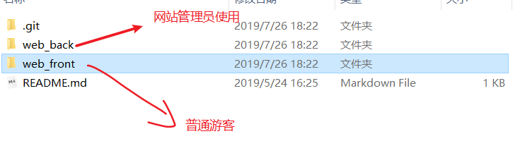
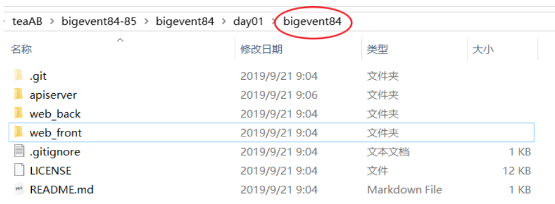
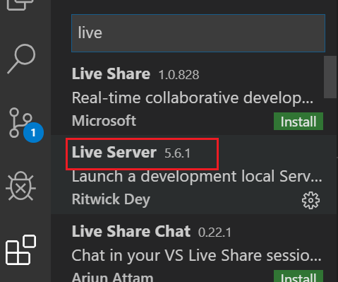
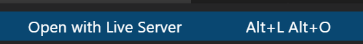
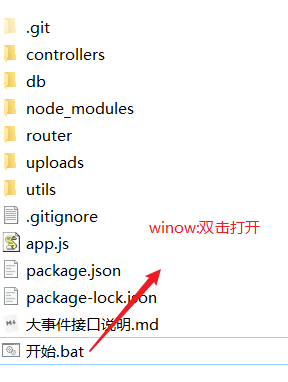

# 大事件

内容管理系统。

## 项目介绍

### 整体演示

- 启动
  - 先启动接口服务器。它用来提供数据。
  - 再启动前端代码。建议采用web服务器的方式。

### 项目说明

静态页面已经提前使用`Bootstrap`实现，本项目要涉及的工作主要是：

- 通过`ajax`的方式跟后台进行数据交互，实现各个功能。

- 主要使用$.ajax和其简写方式，并适当使用axios等其他ajax方式。

- 学习arttemplate模板引擎

- git管理代码

  

### 项目结构

前端

​	分成管理员使用的页面和普通游客访问的页面。

1. 网站后台页面（对应的代码在web_back）

   网站管理员（运维人员）通过使用web_back来作用是对网站数据的增删改查

2. 网站前台页面（对应的代码在web_front）

   作用是对网站内容的数据展示
   
   

后端

​	后端技术使用node，是以接口的形式交付给前端调用。

​	在使用整个项目时，必须要先启动后端程序，并始终保持后端代码是启动的。 

## 项目准备

### 前端代码初始化

我们直接拷贝提前准备好的静态页面，然后按功能列表逐一开发即可。

#### Git基本流程

在开发的过程中，我们使用git来管理代码。

1. 在github上创建一个远程仓库，建议勾选readme.md和.gitignore。例如：bigevent84

2. clone到本地。注意它会在本地创建一个文件夹。

   

   apiserver:后端的接口服务器。

   web_back:前端管理员使用的。

   web_front:前端游客使用的。

   

3. 拷贝静态页面到本地仓库，并完成第一次提交。

   - 把我们事先准备好的管理员页面和游客页面都复制过来。
   - 这一次提交时，会可能会需要输入帐号和密码
   - 本次提交，直接是**提交到了本地**的master分支上。
   - 推送到远程仓库。**git push**

4. 初始化完成，开始开发，`拉出dev分支`，在dev分支上进行功能开发

5. 开发测试无误后，再合并到master分支。


#### 涉及git命令

```shell
git status
git add .
git add yourFile.ext
git commit -m ""
git commit -a -m ""
git push
git checkout -b dev
git checkout master
git branch -d dev
git branch
```


## 安装vscode插件

### live server





好处：

1. 通过一个虚拟web服务器打开网页
2. 实时更新。

### 准备后端服务器

#### 启动后端代码



#### 查看接口文档

整个接口文档在： /docs/**index.html** 或者 接口文档/**README.md**

#### 测试接口

可以在使用之前用postman进行测试


好的，一切准备就绪，开始动手吧。

## 后台开发(web_back/)

### 登陆(login.html)

要点：

- 使用[bootstrap模态框](https://v3.bootcss.com/javascript/#modals)在用户名或者密码错误时给出提示。要注意引入boostrap的js文件及css样式。
- 页面跳转:window.location.href

基本流程：

1. 登录按钮绑定点击事件
2. 判断用户名和密码是否为空
   1. 空：提示用户
   2. 非空：调用接口
      1. 响应回来之后根据提示
         1. 登录成功：去后台首页
         2. 登录失败：使用bootstrap的模态框提示用户

```javascript
const loginUrl = 'http://localhost:8000/admin/login';

$('#btnlogin').click(function(e) {
    var userName = $('#user_name').val().trim();

    var password = $('#password').val().trim();

    $.post(loginUrl, { user_name: userName, password }, function(res) {
        console.log(res);
        if (res.code === 200) {
            window.location.href = './index.html';
            //   页面跳转
        } else if (res.code === 400) {
            $('#myModalContent').text(res.msg);
            $('#myModal').modal();
        }
    });

    e.preventDefault();
}
```

### 代码结构优化

分层的思想

```
js/utils
- config.js 整体配置
- article.js 对文章的操作方法
- category.js 对类别的操作方法 
- user.js 对用户的操作方法 
```

config.js 整体配置

```
var URLIST = {
  user_login: 'http://localhost:8000/admin/login',
  user_logout: 'http://localhost:8000/admin/logout',
  user_getuser: 'http://localhost:8000/admin/getuser',
  user_editInfo: 'http://localhost:8000/admin/userinfo_edit',

  url_article_edit: 'http://localhost:8000/admin/article_edit',
  url_article_search: 'http://localhost:8000/admin/search',

  article_count: 'http://localhost:8000/admin/article_count',
  article_search: 'http://localhost:8000/admin/search',
  article_del: 'http://localhost:8000/admin/article_delete',
  article_publish: 'http://localhost:8000/admin/article_publish',

  category_add: 'http://localhost:8000/admin/category_add',
  category_edit: 'http://localhost:8000/admin/category_edit',
  category_search: 'http://localhost:8000/admin/category_search',
  category_del: 'http://localhost:8000/admin/category_delete'
};

```

article.js 对文章的操作方法

```
var article = {
  getCount: function(callBack) {
    $.getJSON(URLIST.article_count, function(res) {
      callBack(res);
    });
  },

  search: function(params, callBack) {
    $.getJSON(URLIST.article_search, params, function(res) {
      callBack(res);
    });
  },
  getDetail: function(id, callBack) {
    $.getJSON(URLIST.article_search, { id: id }, function(res) {
      callBack(res);
    });
  },
  del: function(id, callBack) {
    $.getJSON(URLIST.article_del, { id: id }, function(res) {
      callBack(res);
    });
  },
  edit: function(fd, callBack) {
    // 2.调接口
    $.ajax({
      type: 'post',
      url: URLIST.url_article_edit,
      data: fd,
      processData: false,
      contentType: false,
      success: function(res) {
        callBack(res);
      }
    });
  },
  publish: function(fd, callBack) {
    $.ajax({
      url: URLIST.article_publish,
      type: 'post',
      data: fd,
      processData: false,
      contentType: false,
      success: function(res) {
        callBack(res);
      }
    });
  }
};
```

category.js 对类别的操作方法 

```
var category = {
  search: function(callBack) {
    $.getJSON(URLIST.category_search, function(res) {
      callBack(res);
    });
  },
  add: function(name, slug, callBack) {
    $.post(
      URLIST.category_add,
      {
        name: name,
        slug: slug
      },
      function(res) {
        callBack(res);
      }
    );
  },
  del: function(id, callBack) {
    $.post(URLIST.category_del, { id: id }, function(res) {
      callBack(res);
    });
  },
  edit: function(param, callBack) {
    var id = param.id;
    var name = param.name;
    var slug = param.slug;
    $.post(
      URLIST.category_edit,
      {
        id: id,
        name: name,
        slug: slug
      },
      function(res) {
        callBack(res);
      }
    );
  }
};

```

user.js 对用户的操作方法

```javascript
var user = {
  login: function(name, password, callBack) {
    $.ajax({
      url: URLIST.user_login,
      type: 'post',
      data: { user_name: name, password },
      success: function(res) {
        callBack(res);
      }
    });
  },
  logout: function(callBack) {
    $.post(URLIST.user_logout, function(res) {
      callBack(res);
    });
  },
  getInfo: function(callBack) {
    $.get(URLIST.user_getuser, function(res) {
      callBack(res);
    });
  },
  editInfo: function(fd, callBack) {
    $.ajax({
      url: URLIST.user_editInfo,
      type: 'post',
      data: fd,
      processData: false,
      contentType: false,
      success: function(res) {
        callBack(res);
      }
    });
  }
};
```


### 改写用户登陆的代码

```javascript
<script src="./js/utils/config.js"></script>
<script src="./js/utils/user.js"></script>
<script>
var name = $('#txtName').val();
var password = $('#txtPwd').val();
if (name === '' || password === '') {
    //提示一下
    $('#modalMsg').text('用户名密码不能为空!');
    $('#myModal').modal('show');
    return;
}
user.login(name, password, function(res) {
    if (res.code === 200) {
        // alert("登录成功");
        // $('#myModal').modal('show')
        window.location.href = 'index.html';
    } else {
        // 登录出错，错误信息由后端保存在msg中。
        $('#modalMsg').text(res.msg);
        $('#myModal').modal('show');
    }
});
</script>
```


### 用户登出 index.html

1. 首页中的登出按钮绑定点击事件
2. 弹出对话框让用户确认
   1. 点击确认：调用登出接口，并返回登录页
   2. 点击取消：关闭对话框

```javascript
$('#btnLogout').click(function() {
          
    user.logout(function(res) {
        console.log(res);
        if (res.code === 200) {
            window.location.href = 'login.html';
        }
    });
});
```


### 首页展示-用户信息

```javascript
user.getInfo(function(res) {
    if (res.code === 200) {
        $('#nickname').text(res.data.nickname);
        $('#user_pic').attr('src', res.data.user_pic);
    }
});
```

### iframe结构

iframe 元素会创建包含另外一个文档的内联框架。配合a标签的target属性一起使用。

```html
<body>
    <div class='container'>
        <a href="1.html" target="main">1</a>
        <a href="2.html" target="main">2</a>
    </div>
    <iframe src="1.html" name="main" frameborder="0" style="width:100%"></iframe>

</body>
```

注意：

- a标签的target值是firame的name

### 首页展示-文章信息

main_count.html

```javascript
<script src="./js/utils/config.js"></script>
<script src="./js/utils/article.js"></script>
<script>
    article.getCount(function(res) {
    // console.log(res);
    if (res.code === 200) {
        $('#all_count').text(res.data.all_count);
        $('#day_count').text(res.data.day_count);
    }
});
</script>
```


### 文章类别管理-查询

#### 核心代码

```javascript
category.search(function(res) {
    console.log(res);
    if (res.code === 200) {
        $('#tbody').html(template('categoryTr', res));
    }
});
```


#### 模板字符串拼接

略


### 文章类别管理-删除

通过arttemplate生成页面，a标签中动态绑定js函数，并传入要删除的参数。

```html
    <script type="text/html" id="table">
      {{each data item}}
        <tr>
              <td>{{item.name}}</td>
              <td>{{item.slug}}</td>
              <td class="text-center">
              <a href='javascript:editTr({"id":"{{item.id}}","slug":"{{item.slug}}","name":"{{item.name}}"});' class="btn btn-info btn-xs">编辑</a>
              <a href="javascript:deleteTr({{item.id}});" class="btn btn-danger btn-xs">删除</a>
              </td>
          </tr>
      {{/each}}
    </script>
```

核心代码如下：

```javascript
function doDel(id) {
    // 基本步骤 ：
    // 1. 拿到id值：在模板中已经拼接上id了。
    // 2. 调用接口，实现删除
    // 3. 根据请求的数据，做后续的操作
    //
    category.del(id, function(res) {
        console.log(res);
        if (res.code === 200) {
            // 删除成功
            // 重新请求数据，更新表格
            doQuery();
        }
    });
}
```


### 文章类别管理-添加

添加的主体使用模态框。而修改操作时也是用同一个模态框，要注意区别它们的使用。

```javascript
$('#model_add').click(function() {
    if ($('#addModal #model_add').html() === '添加') {
        //做添加
        doAdd();
    } else {
        //做修改
        doEdit();
    }
});

// 做添加操作
function doAdd() {
    // 基本步骤 ：
    // 1.获取用户的参数
    // 2.调用接口
    // 3.添加成功
    // 3.1隐藏弹出框
    // 3.2重新请求数据
    var name = $('#txtName')
    .val()
    .trim();
    var slug = $('#txtSlug')
    .val()
    .trim();

    category.add(name, slug, function(res) {
        if (res.code === 200) {
            $('#addModal').modal('hide');

            // 不提示错误
            $('#errMsg')
                .hide()
                .text('');

            // 清除 输入框的内容
            $('#txtName').val('');
            $('#txtSlug').val('');

            // 重新请求数据
            doQuery();
        } else {
            // 提示错误
            $('#errMsg')
                .show()
                .text(res.msg);
        }
    });
}

// 做编辑
function doEdit() {
    // 基本步骤 ：
    // 1. 给a标签添加一个函数：用来对要编辑的内容进行初始化
    // 2. 由于编辑和添加共用一个dialog，所以，给确认按钮添加click时，
    // 要注意当前的操作是修改，还是添加

    // alert(currentEditId)
    // 基本步骤 ：
    // 1.获取用户的参数
    var name = $('#txtName')
    .val()
    .trim();
    var slug = $('#txtSlug')
    .val()
    .trim();
    // 2.调用接口
    category.edit(
        {
            id: currentEditId,
            name: name,
            slug: slug
        },
        function(res) {
            console.log(res);
            if (res.code === 200) {
                $('#addModal').modal('hide');
                doQuery();
            }
        }
    );
}
```


### 文章类别管理-编辑

编辑时，区别于添加。

```javascript
// 基本步骤 ：
//  1. 添加editTr函数
//   1.1 获取传入的参数，并显示在弹出框中
//   1.2 在用户点击保存时:
//       获取用户填入的数据
//       ajax请求接口
function editTr(data) {
    console.log(data);
    $('#addModal').modal();
    $('#addModal .modal-title').html('修改分类');
    $('#hiddenEidtID').val(data.id);
    $('#txt_name').val(data.name);
    $('#txt_slug').val(data.slug);
    $('#model_add').text('保存');
}

```


### 文章列表管理-查询

```javascript
function doQuery() {
    article.search({ page: currentPageNumber, type: currentType, state: currentState },
                   function (res) {
        $("#tbody").html(template("template_article", res))
    })
}
```


### 文章列表管理-分页

1. 使用 Ajax 请求获取文章列表数据

2. 客户端分页插件使用


```javascript
//记录当前总页数
var currentTotalpages = ""
function doQuery() {
    article.search({ page: currentPageNumber, type: currentType, state: currentState },
                   function (res) {
        $("#tbody").html(template("template_article", res))
       
        // 所以，当totalpages变化时，我们把整个分页的插件重置
        if (res.totalPage !== currentTotalpages) {
            currentTotalpages = res.totalPage;
            //销毁整个插件
            $(".pagination").twbsPagination("destroy");

            //重新生成分页插件
            $('.pagination').twbsPagination({
                currentPage: 1,  // 初始页
                totalPages: res.totalPage,  // 总页数，可以通过翻页，或者最后一页
                startPage: 1,
                visiblePages: 4, // 可见页码
                first: "首页",
                last: "未页",
                prev: '上一页',
                next: '下一页',
                initiateStartPageClick: false,
                onPageClick: function (event, page) {
                    // page： 当前是第几页
                    console.log(page)
                    currentPageNumber = page;
                    // 发请求：求第page页的数据。
                    doQuery();
                }
            });
        }

    })
}
```


### 文章列表管理-筛选

### 文章列表管理-添加

### 文章列表管理-删除

使用 Ajax 请求完成删除文章

### 文章列表管理-编辑

1. 点击保存按钮
2. 实例化formData对象
3. 通过ajax提交数据

## 前台开发

### 首页文章获取

1. 使用 Ajax 请求获取文章数据
2. 使用模板引擎渲染到页面上


### 查看文章详情


## 模板引擎

### 第1节 模板引擎介绍

#### 常见模板引擎

开发网页的过程中，我们会遇到一个典型的问题：如何把从数据库中取回的数据 转化成 html结构？ 这个过程也有一个专门的名称渲染(rending)。举个小例子，你拿到的数据是:

```
var data = {name:'jack',hobby:['吃饭','睡觉','打豆豆']}
```

而你要生成的对应的html结构是:

```
<h4>姓名:jack</h4>
<h4>爱好: 吃饭 睡觉 打豆豆</h4>
```

这是一个简单的需求，我们可以直接使用字符串拼接就能够完成。

```
var htmlStr = "<h4>姓名:"+data.name +"</h4><h4>爱好: "+data.hobby[0] +data.hobby[1] +data.hobby[2]</h4>
```

当然，还有可能你的结构要复杂一点，例如是：

```
<h4>姓名:jack</h4>
<dl>
	<dt>爱好</dt>
	<dd>吃饭</dd>
	<dd>睡觉</dd>
	<dd>打豆豆</dd>
</dl>
```

这样，使用字符串做拼接就会比较麻烦了。
好的，到此为止，我们面临了两个问题：

1. 把一个js对象转成一个html字符串
2. 把同一个js对象转成不同的html字符串

我们可以使用一个简单的公式来表达：

```
 html字符串 = 渲染函数(原数据，模板)
```

这里涉及的技术就是模板引擎。

模板引擎是为了使用户界面与业务数据（内容）分离而产生的，它可以生成特定格式的文档，用于网站的模板引擎就会生成一个标准的文档。

模板引擎的实现方式有很多，最简单的是“置换型”模板引擎，这类模板引擎只是将指定模板内容（字符串）中的特定标记（子字符串）替换一下便生成了最终需要的业务数据（比如网页）。置换型模板引擎实现简单，但其效率低下，无法满足高负载的应用需求（比如有海量访问的网站），因此还出现了“解释型”模板引擎和“编译型”模板引擎等。

模板引擎有很多：

- baiduTemplate
- artTemplate
- juicer: http://juicer.name/或https://github.com/PaulGuo/Juicer/zipball/master#download
- doT：doT source:https://github.com/olado/doT Docs:http://olado.github.com/doT/
- tmpl
- handlebars:http://handlebarsjs.com/或https://raw.github.com/wycats/handlebars.js/1.0.0-rc.4/dist/handlebars.js
- easyTemplate：
- underscoretemplate: 
- mustache:
- kissytemplate

虽然模板引擎的产品比较多，但它们的使用方法大多是相同的，下面来分别看下 baiduTemplate和artTemplate的使用。

```
<script id="tmp" type="text/html">
      <h4>姓名:<%= name %></h4>
      <dl>
        <% for(var i=0;i< hobby.length;i++) {%>
          <dt><%= hobby[i] %></dt>
        <%}%>
      </dl>
    </script>
    <script src="./baiduTemplate.js"></script>
    <script>
      var data = { name: 'jack', hobby: ['吃饭', '睡觉', '打豆豆'] };
      console.log(baidu.template('tmp', data));
    </script>
```

```
<script id="tmp" type="text/html">
  <h4>姓名:{{name}}</h4>
  <dl>
    {{each hobby item}}
      <dt>{{item}}</dt>
      {{/each}}
  </dl>
</script>
<script src="./template-web.js"></script>
<script>
  var data = { name: 'jack', hobby: ['吃饭', '睡觉', '打豆豆'] };
  console.log(template('tmp', data));
</script>
```

它们的语法非常像，是吧。基本上，学会了一个，其它的也差不了太多了。

### 第2节 arttemplate

我们以arttemplate作为代表，来学习模板引擎的作用。 

#### artemplate快速使用

官方文档地址：https://aui.github.io/art-template/zh-cn/docs/index.html

使用步骤

1. 引入template-web.js文件
2. 定义模板，注意指定script的id和type属性
3. 准备数据对象。(变量，数组等)
4. 调用template函数，为模板分配数据，获得渲染结果，template的格式如下：

```
 html字符串 = template(模板的id,数据对象)
```

参考代码如下：

```
<!-- 1. 引入template-web.js -->
<script src="/template-web.js"></script>
<!-- 2. 定义模板（注意script标签的id和type必须指定） -->
<script id="tmp" type="text/html">
  <h2>{{data}}</h2>
</script>
<script>
   // 3. 编译模板
   //  html字符串 = 模板 + 数据
    var htmlStr = template('tmp', {
        data: 'hello world'
    });
    console.log(htmlStr)
</script>
```


#### 模板语法

下面我们详细说明arttemplate的语法。
它支持两种语法：

- 标准语法
- 原始语法

以输出变量的值为例，标准语法如下

```
{{value}}
{{data.key}}
{{data['key']}}
{{a ? b : c}}
{{a || b}}
{{a + b}}
```

原始语法如下

```
<%= value %>
<%= data.key %>
<%= data['key'] %>
<%= a ? b : c %>
<%= a || b %>
<%= a + b %>
```

下面我们来看两种常见的语法结构：

- 条件
- 循环

`条件`

```javascript
// 模板写法
<script id="tmp" type="text/html">
{{if age > 18}}
	大于18
{{else}}
	小于18
{{/if}}
</script>

// template函数写法
var html = template('tmp', {
    age: 20
});
```

`循环`

```
// 模板写法1
{{each arr}}
	{{$index}} -- 数组的下标
	{{$value}} -- 数组的值
{{/each}}

// 模板写法2
{{each arr item idx}}
	{{idx}} -- 数组的下标
	{{item}} -- 数组的值
{{/each}}

// template函数写法
var html = template('id', {
    arr: ['apple', 'banana', 'orange']
});
```

#### 使用外部函数

如果你希望在模板内部使用模板之外定义的函数，可以以模板变量template.defaults.imports为桥梁，去调用外部的函数。
第一步：导入外部函数。这一步相当于把函数挂载在template.defaults.imports对象上。

```
function add1(a){return a+1;}
template.defaults.imports.add1 = add1
```

第二步：在模板中调用函数
模板通过 $imports 可以访问到模板外部的全局变量与导入的变量。

```
<% $imports.add1(100) %>
```

[参考](https://aui.github.io/art-template/zh-cn/docs/imports.html)


## 总结

1. 使用git时记得多提交
2. 其他分支的逻辑写完之后在合并到主分支
3. 数据提交时验证准确性
4. ajax结合模板引擎完成复杂数据的渲染
5. 合理利用插件简化编码量